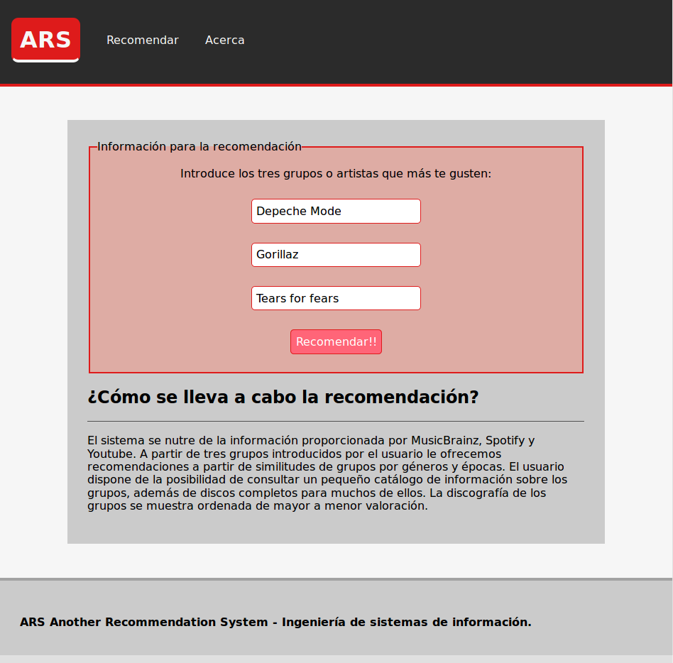

# Another recommendation system
Music recommendation system made by @Lothar94, @daniL16, @ncordon with academic purpose.

Deployed [here](http://recommendation-system-160616.appspot.com/)




## How does it work?
You have to introduce from 1 to 3 groups you like (normally, kind of similar) and the system will ask Spotify API for recommendations. We have or own refinement's algorithm to offer more proper recommendations based on year, area, genres and MusicBrainz's tags for a group.

When you get a recommendation, you can consult deeper information about a specific group. 

All recent searches are kept in cache of Google App Engine, and group information alredy asked for is stored in a database for more later queries.

## Structure of files

### User level
- `app.yaml`: configuration of the GAE(Google App Engine) app
- `params.py`: parameters for the recommendations
- `main.py`: routing of the web app.
- `recommender.py`: recommendation calcs layer
- `gathering.py`: data gathering layer
- `datastore.py`: data integration and database read & write layer

### Admin level
- `index.yaml`: database indexes configuration
- `cron.yaml`: programmed tasks configuration
- `admin_tasks.py`: routing of the admin tasks handlers
- `database_tasks.py`: database update tasks

## Local tryout
To try the app locally, `python 2.7` and `Google Cloud Python SDK` are required. Once you met that requirement, you should follow these steps:

- Substitute Youtube API and Spotify API keys in the file `app.yaml`:

```
       SPOTIPY_CLIENT_ID: example
       SPOTIPY_CLIENT_SECRET: example
       YOUTUBE_DEV_KEY: example
```

- `make config` to install the necessary libaries

- `make mount` to try the application locally

- Enter [localhost:8080](localhost:8080) in your web browser

